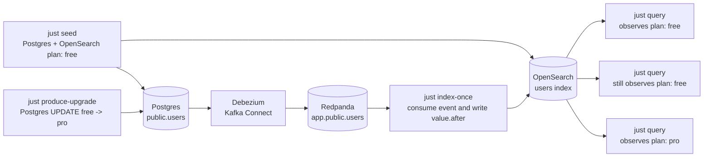

# Rust Change Data Capture Demo

https://wcygan.net/change-data-capture

This is a small Rust demo for the stale-read window that CDC solves. It runs
the full local pipeline:

- Postgres is the source of truth for `public.users`.
- Debezium runs inside Kafka Connect and captures Postgres row updates.
- Redpanda provides the Kafka-compatible broker.
- The Rust indexer consumes Debezium events and applies `value.after` to
  OpenSearch.
- The `cdc` CLI seeds, updates, and queries the demo state.

## How It Works



## Run The Demo

Run the whole teaching loop:

```bash
just demo
```

Or step through it manually:

```bash
just up
just bootstrap
just reset
just seed
just query
just produce-upgrade
just query
just index-once
just query
```
