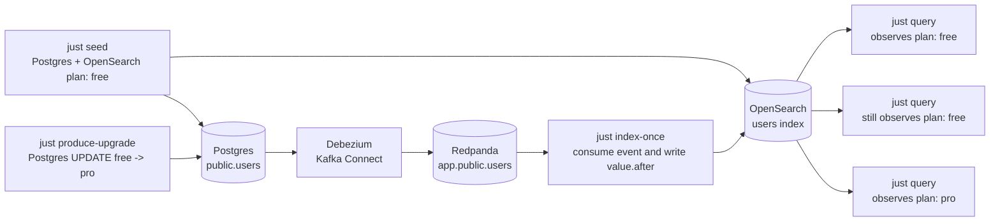

# Rust Change Data Capture Demo

https://wcygan.net/change-data-capture

This is a small Rust demo for the stale-read window that CDC solves. It runs
the full local pipeline:

- Postgres is the source of truth for `public.users`.
- Debezium runs inside Kafka Connect and captures Postgres row updates.
- Redpanda provides the Kafka-compatible broker.
- The Rust indexer consumes Debezium events and applies `value.after` to
  OpenSearch.
- The `cdc` CLI seeds, updates, and queries the demo state.

## How It Works



## Run The Demo

### Prerequisites

- Rust stable toolchain with Cargo, rustfmt, and Clippy.
- Docker with Docker Compose v2.
- [`just`](https://github.com/casey/just) for the project command runner.

Run the whole teaching loop:

```bash
just demo
```

Or step through it manually:

```bash
just up
just bootstrap
just reset
just seed
just query
just produce-upgrade
just query
just index-once
just query
```

`just demo` starts Postgres, Redpanda, Kafka Connect, and OpenSearch through
Docker Compose, then runs the stale-read flow end to end.

## Development Checks

Run the fast local verification before handing off changes:

```bash
just check
```

That command checks formatting, runs Clippy with warnings denied, and runs the
unit tests.

Run the real Docker-backed Debezium flow when you need to verify the whole
pipeline:

```bash
just integration-test
```

The integration test starts the local services, registers the Debezium
connector, proves that OpenSearch can briefly return the stale `free` plan, then
runs the Rust indexer once and verifies the read model catches up to `pro`.

## License

MIT
