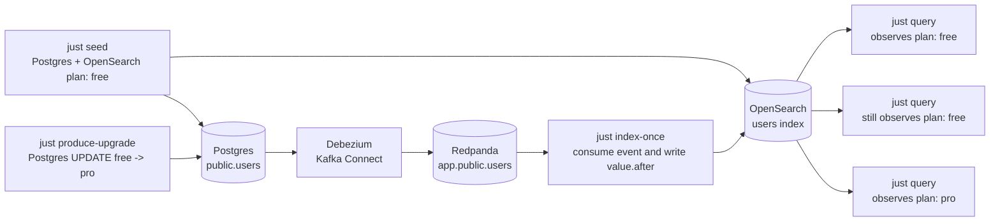

# Rust Change Data Capture Demo

This is a small Rust demo for the stale-read window that CDC solves. It runs
the full local pipeline:

- Postgres is the source of truth for `public.users`.
- Debezium runs inside Kafka Connect and captures Postgres row updates.
- Redpanda provides the Kafka-compatible broker.
- The Rust indexer consumes Debezium events and applies `value.after` to
  OpenSearch.
- The `cdc` CLI seeds, updates, and queries the demo state.

## How It Works



## Run The Demo

Run the whole teaching loop:

```bash
just demo
```

Or step through it manually:

```bash
just up
just bootstrap
just reset
just seed
just query
just produce-upgrade
just query
just index-once
just query
```

Expected story:

1. `just up` starts Postgres, Redpanda, Kafka Connect, and OpenSearch.
2. `just bootstrap` creates `public.users` and registers the Debezium connector.
3. `just seed` writes `public.users` and `users/_doc/42` with `plan: free`.
4. The first `just query` shows `plan: free`.
5. `just produce-upgrade` updates the source Postgres row from `free` to `pro`.
6. The next `just query` still shows `plan: free`, because the read model has
   not caught up.
7. `just index-once` consumes the Debezium update from Redpanda and updates
   OpenSearch.
8. The final `just query` shows `plan: pro`.

For continuous indexing after the manual stale-read window is clear:

```bash
just indexer-run
```

## Commands

```bash
just demo
just up
just down
just clean
just status
just logs redpanda
just logs connect
just bootstrap
just connect-status
just seed
just source-query
just query
just produce-upgrade
just index-once
just indexer-run
just reset
just check
just integration-test
```

## Configuration

The defaults are for the included Docker Compose services.

| Variable | Default |
| --- | --- |
| `CDC_KAFKA_BROKERS` | `localhost:19092` |
| `CDC_TOPIC_PREFIX` | `app` |
| `CDC_TOPIC` | `app.public.users` |
| `CDC_CONSUMER_GROUP` | `cdc-demo-indexer` |
| `CDC_OPENSEARCH_URL` | `http://localhost:9200` |
| `CDC_OPENSEARCH_INDEX` | `users` |
| `CDC_CONSUME_TIMEOUT_MS` | `10000` |
| `CDC_POSTGRES_HOST` | `localhost` |
| `CDC_POSTGRES_PORT` | `15432` |
| `CDC_POSTGRES_USER` | `cdc` |
| `CDC_POSTGRES_PASSWORD` | `cdc` |
| `CDC_POSTGRES_DB` | `app` |
| `CDC_CONNECT_URL` | `http://localhost:8083` |
| `CDC_CONNECTOR_NAME` | `cdc-demo-postgres-users` |
| `CDC_CONNECT_POSTGRES_HOST` | `postgres` |
| `CDC_CONNECT_POSTGRES_PORT` | `5432` |
| `CDC_CONNECTOR_SLOT_NAME` | `cdc_demo_users_slot` |
| `CDC_CONNECTOR_PUBLICATION_NAME` | `cdc_demo_users_publication` |
| `CDC_CONNECTOR_WAIT_TIMEOUT_MS` | `30000` |

## Verify

```bash
just check
```

`just check` runs formatting, Clippy, and unit tests for CLI parsing, Debezium
event decoding, validation failures, and OpenSearch document mapping.

Run the Docker-backed end-to-end CDC test:

```bash
just integration-test
```

That command starts the full local stack, registers an isolated Debezium
connector, proves the stale read after a Postgres update, runs `indexer once`,
and verifies that OpenSearch catches up to `plan: pro`.
